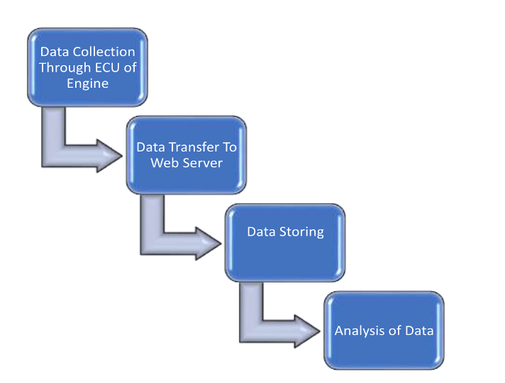
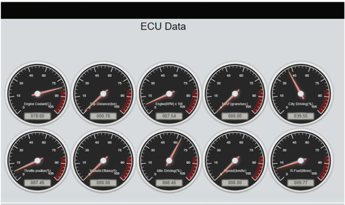
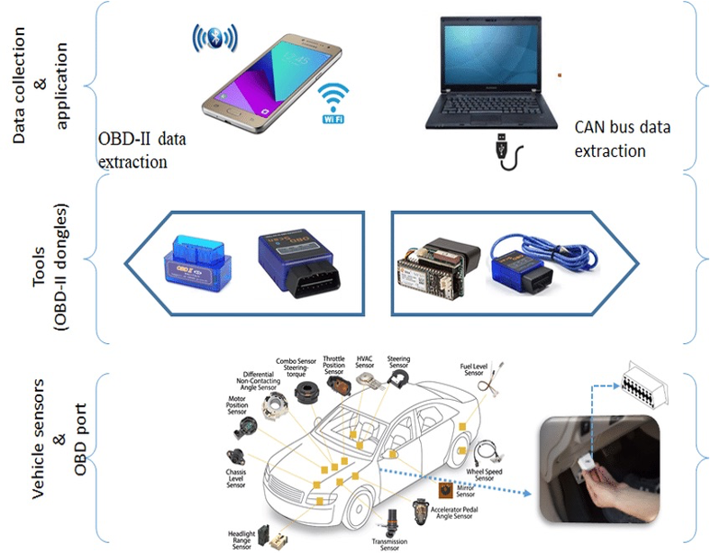
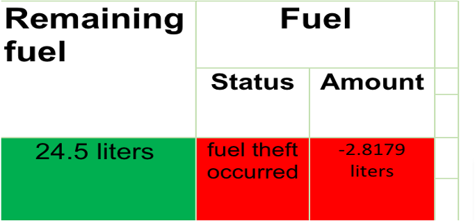

# Fuel Theft Prediction and Vehicle Monitoring System

## **Overview**
This project is an **Integrated Vehicle Monitoring, Maintenance, and Management System (IV3MS)** that focuses on predictive and real-time monitoring of vehicle health, including an innovative **Fuel Theft Prediction System**. It utilizes **OBD-II technology**, data processing, and real-time monitoring to achieve efficient maintenance, fuel management, and theft detection.

---

## **Key Objectives**
1. **Fuel Monitoring and Theft Detection**:
   - Identify unauthorized fuel usage.
   - Send notifications when theft or unusual activity is detected.
2. **Real-Time Vehicle Monitoring**:
   - Collect data on fuel economy, engine performance, and vehicle health.
   - Enable real-time insights for better decision-making.
3. **Fuel Management Optimization**:
   - Improve fuel consumption metrics for efficiency.
   - Provide actionable insights to minimize operational costs.

---

## **Main Features**

### **1. OBD-II Integration**
- **Data Collection**:  
  Data is gathered from vehicle sensors via the **OBD-II device** and transferred to a mobile application.  
  

---

### **2. Web Server & Mobile Interface**
- **Real-Time Monitoring**:  
  Live dashboards display data like fuel economy, throttle position, and remaining fuel.  
  

---

### **3. Fuel Theft Detection**
- **Algorithm Workflow**:  
  Detects sudden drops in fuel levels during idle states or when the engine is off.  
  

---

### **4. Case Study**
- Simulated thefts and fuel refilling events to test the system.  
  

---

### **Technological Workflow**
- From **Data Collection** to **Data Processing and Alerts**.  
  

---

## **How to Use**
1. **Setup**:
   - Connect the OBD-II dongle to your vehicle's diagnostic port.
   - Pair the OBD-II device with the Torque app on your smartphone.
2. **Data Transfer**:
   - Configure the Torque app to send data to the web server.
3. **Monitoring**:
   - Use the dashboard to track vehicle health, fuel efficiency, and theft alerts.

---

## **Future Enhancements**
- **Hybrid Vehicle Integration**: Extend support for hybrid and electric vehicles.
- **Notification System**: Automate email and SMS notifications for theft and maintenance alerts.
- **Fleet Management**: Optimize the system for large-scale fleet monitoring.

---

## **Acknowledgments**
This project was supervised by **Dr. Muhammad Alam Zaib Khan** and supported by the **University of Engineering and Technology, Peshawar**.

---
